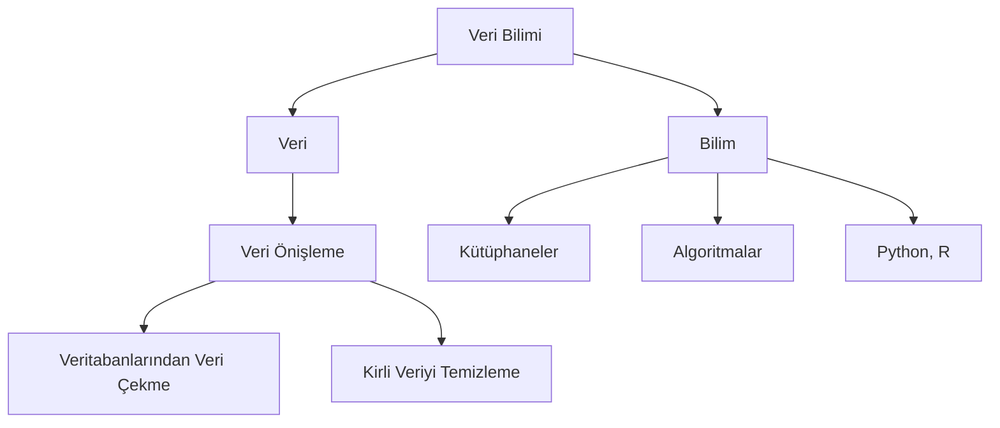
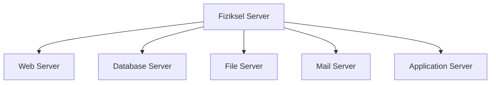
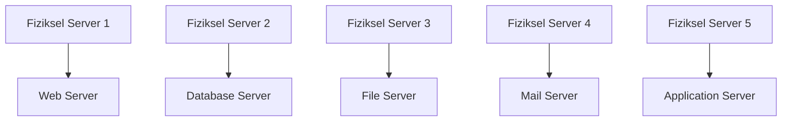
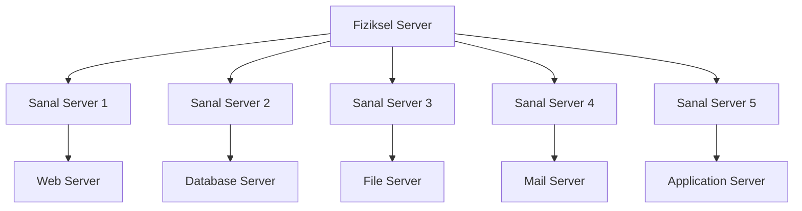

# VERİTABANI
- Temel anlamda verileri listeler halinde tablo ve satırlarda tutan her yapı aslında kendi çapında veritabanıdır.
---
## Veritabanı Yönetim Sistemi
- Network üzerinde belli bir portu dinleyip kendisine gelen SQL komutlarını kendi kaynaklarını kullanarak çalıştıran ve aynı anda birden fazla istemciye hizmet veren veritabanı sistemlerine veritabanı yönetim sistemi denir.
---
## Veritabanı Sunucu
- Microsoft SQL Server, Oracle, PostgreSQL birer veritabanı sunucu yazılımıdır. Networkten gelen koumtları dinleyen ve bu komutlardan gelen isteklere göre kendi kaynaklarını kullanarak sonucu döndüren bir mekanizma.
---

# SQL
- (**S**tructured **Q**uery **L**anguage) (Yapısal Sorgulama Dili)

---
## Neden SQL?

---
# İlişkisel Veritabanı Kavramı (RDMS)
- Tekrar eden verileri tekilleştirmek amacıyla kullanılan veritabanı sistemleridir.

  

  

---
# Sanal Makine Kavramı
- Fiziksel bir işletim sisteminin içinde başka işletim sistemlerinin de gerçek birer bilgisayar gibi çalıştırılması kavramıdır.

- Öncesinde:

- Sonrasında:

